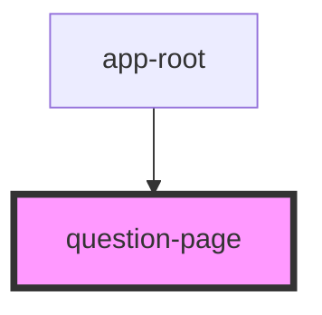

# question-page

<!-- Auto Generated Below -->

## Properties

| Property   | Attribute  | Description | Type     | Default     |
| ---------- | ---------- | ----------- | -------- | ----------- |
| `question` | `question` |             | `any`    | `undefined` |
| `section`  | `section`  |             | `string` | `undefined` |

## Events

| Event            | Description | Type               |
| ---------------- | ----------- | ------------------ |
| `answerSelected` |             | `CustomEvent<any>` |

## Dependencies

### Used by

 - [app-root](../app-root)

### Graph

----------------------------------------------

*Built with [StencilJS](https://stenciljs.com/)*
