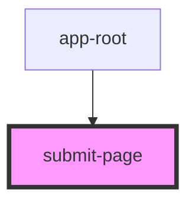

# submit-page

<!-- Auto Generated Below -->

## Properties

| Property  | Attribute | Description | Type  | Default     |
| --------- | --------- | ----------- | ----- | ----------- |
| `answers` | `answers` |             | `any` | `undefined` |

## Dependencies

### Used by

 - [app-root](../app-root)

### Graph

----------------------------------------------

*Built with [StencilJS](https://stenciljs.com/)*
